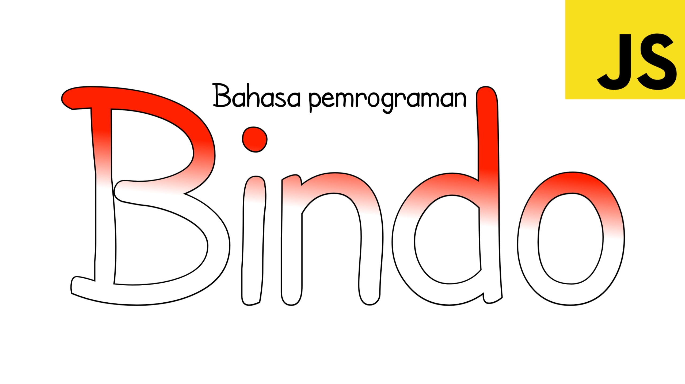

Bindo adalah [toy programming language](https://www.techopedia.com/definition/22609/toy-language) atau bahasa pemrograman yang hanya digunakan untuk main-main ataupun edukasi, bukan untuk membuat program tingkat tinggi. Bahasa ini dibuat menggunakan JavaScript, sehingga bahasa ini berfungsi sebagai library JavaScript

# Perkenalan

Bindo adalah singkatan dari Bahasa Indonesia, sesuai namanya, Bindo menggunakan perintah yang mudah dibaca dan dipahami bagi orang yang belum terlalu familiar dengan bahasa pemrograman karena perintahnya menggunakan kosa kata Bahasa Indonesia

```
ingat salam adalah "Assalamualaikum"
tulis salam
```

Hasil:

```
Assalamualaikum
```

Untuk saat ini Bindo masih berada di versi awal sehingga hanya memiliki sedikit fitur, fitur lainnya akan dikembangkan di versi mendatang

Untuk mencoba Bindo secara online, kamu bisa kunjungi https://muraft.great-site.net/demo/bindo

## Pelajari lebih lanjut
- Untuk mempelajari dasar-dasar bahasa ini, kunjungi [tutorial.md](tutorial.md)
- Untuk memlihat daftar perintah di bahasa ini dan penggunaannya, kunjungi [perintah.md](perintah.md)
- Untuk menggunakan dan menyetel compiler Bindo di websitemu, kunjungi [penyetelan.md](penyetelan.md)
- Untuk melihat changelog dan versi terbaru bahasa ini, kunjungi [releases](https://github.com/coolraptor08/bindo/releases)
